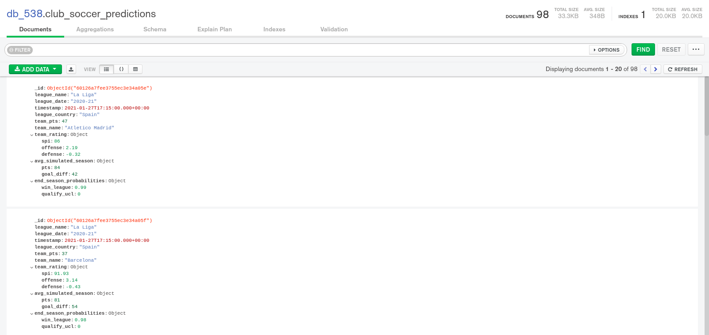

# FiveThirdyEight
Scraping predictions and Soccer Power Index (SPI) for the top 5 leagues using scrapy and saving results in MongoDB using mongoengine.
Site link: https://projects.fivethirtyeight.com/soccer-predictions/premier-league/

## Stack
- [Scrapy](https://docs.scrapy.org/)
- [MongoEngine](http://docs.mongoengine.org/)

## Setup

Clone the repository and change the working directory:

    git clone https://github.com/SvNext/FiveThirdyEight.git
    cd FiveThirdyEight
Create and activate the virtual environment:

    python3 -m venv env
    source env/bin/activate
Install requirements:

    pip install -r requirements.txt

Run the soccer_spider:

    cd scrapy_538
    scrapy crawl soccer_spider
    
    
## Results

The contents of MongoDB are shown in the following figure

